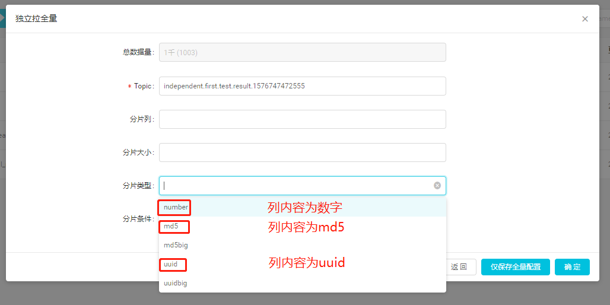

* This will become a table of contents (this text will be scraped).
 {:toc}

# 1. 总体说明

## 1.1 总体模块概览

DBUS主要由两大部分组成：贴源数据采集和多租户数据分发。两个部分之间以Kafka为媒介进行衔接。


贴源数据采集通过简单灵活的配置，以无侵入的方式对源端数据进行采集，实时获取增量数据，提供丰富、完备的数据采集、脱敏、转换、汇聚功能，并支持全量数据拉取，经过转换处理后成为统一JSON的数据格式（UMS）。每张表只接入一次，只有一个数据流及一份输出数据与之对应。

多租户数据分发，是为限制不同租户，只能访问分配给他的数据资源；以及，如果两个租户有不同的数据处理逻辑（例如：不同的脱敏需求），也能区别对待处理，从而灵活满足多条业务线租户的不同需求。

由图我们可以清楚的看到，贴源数据采集与多租户模块是解耦的。也就是说，如果没有多租户需求（数据隔离、资源隔离、不同脱敏策略等），可以忽略多租户这一级，加完贴源数据线，直接消费源端数据采集这一级输出到kafka的数据即可。

一张表如果被分给N个租户，就至少会被拷贝分发N次。这个拷贝过程中，可加入一些个性化的处理，例如脱敏策略。此外，如果一个租户需要对同一张表进行不同的处理，再输出，也是可以的。方法是，再建一个处理逻辑不同的Topology来接入、“拷贝分发”该表的数据，例如下图中的Router1_2。这种情况下，表被“拷贝分发”的次数就更多了。但同一张表在一个Topology上只能接入一份。

## 1.2 数据接入操作流程概览

引入多租户后，接入条数据线的工作分为“管理员”和“租户”操作两个部分。为了让用户有一个清晰的了解，在此先把加入一条线的流程简明扼要地介绍一下。后续的章节再详述具体步骤。

### 1.2.1 管理员

（1）找源端Owner方开放相关数据访问权限。

（2）接入源端数据。根据不同的数据线，安装配置不同的组件来接入源端数据，例如Canal、Oracle、Filebeat、LogStash、Flume等。

（4）管理员在DBUS Keeper中新增一条数据线，并将目标Schema/Table添加进来。

（5）如果有脱敏需求，在表列表页面对表进行脱敏配置。

（6）管理员启动对应数据线Topology，并启动新加入表的“数据流”。

如果没有多租户需求，到这一步，直接消费贴源端采集输出的数据即可。

如果有多租户需求，继续下面步骤。

（7）创建用户、Sink等资源，如果现有资源不能满足需求。

（8）在项目管理模块，创建项目、分配资源、配置脱敏等。

### 1.2.2 租户

租户拿到管理员分配的账号，登入系统，能看到自己有权限看到的项目。

（1）点击“拓扑管理”菜单，新增Topology。

（2）点击“项目表管理”菜单，“新增”表，选择表数据在哪个流（Topology）上流转、指定输出Sink端、选择输出列、配置脱敏规则等。

（3）点击“启动”按钮，启动流。

添加表的工作就完成了。

需要的话，租户可以通过“拉全量”操作进行数据初始化。

# 2. 管理员手册

说明：DBUS提供了灵活的脱敏策略支持。但若无脱敏需求，本章节有关脱敏的部分可一律忽略，不影响使用。另，即便有脱敏需求，亦可数据线搭建起来跑通后，再行根据指南补充配置脱敏事宜。

脱敏详细介绍参见：[脱敏配置介绍](#encode-intro)

## 2.1 贴源数据采集

下面分别介绍不同类型数据源的接入步骤。每一部分都包含了完整的，新增该类型数据源的步骤。您只用关注您想要接入的数据源即可。

### 2.1.1 Oracle数据线接入

点击[Oracle数据线接入](install-oracle-source.html)，了解Oralce类型数据源加线、加表步骤。

### 2.1.2 MySql数据线接入

点击[MySql数据线接入](install-mysql-source-auto.html)，了解MySql类型数据源加线、加表步骤。

### 2.1.3 LogStash数据线接入

点击[LogStash数据线接入](install-logstash-source.html)，了解LogStash类型数据源加线、加表、规则配置及应用步骤。

### 2.1.4 FileBeat数据线接入

点击[FileBeat数据线接入](install-filebeat-source.html)，了解FileBeat类型数据源加线、加表、规则配置及应用步骤。

### 2.1.5 Flume数据线接入

点击[Flume数据线接入](install-flume-source.html)，了解Flume类型数据源加线、加表、规则配置及应用步骤。

## 2.2 租户管理

注：如果没有多租户需求，可跳过此章节。

项目是DBus Keeper进行租户隔离、资源分配的基本单元。创建项目时，会涉及到项目**用户分配**及**Sink分配**。管理员可通过顶部的“**用户管理**”和“**Sink管理**”两个菜单入口创建、管理用户及Sink，准备好项目所需的用户及Sink资源。

Sink即数据输出目标端，现阶段一般为Kafka集群。Sink既可借用DBUS贴源数据采集输出使用的Kafka集群，也可使用完全独立的一套Kafka集群。


### 2.2.1 新建项目

管理员新建项目时，可对项目进行资源分配、报警策略设置等。


特别注意下，“Resource管理”界面，管理员可控制租户是否有对目标表拉全量的权限。只有这里放开了全量权限，租户在其项目表界面才能看到“拉全量”按钮。

管理员也可在此配置该项目需强制遵守的列脱敏规则。关于脱敏细节，请参考：[4.2 脱敏配置介绍](#encode-intro)


### 2.2.2 重要易混淆的概念

**2.2.2.1 源端表 vs 资源**


 一张源端表可通过“Resource管理”，被分发给多个项目。

**2.2.2.2 资源 vs 项目表** 

如上所述，“资源”是管理员分配给租户，租户有权限看到的表，是一个偏静态的概念。

“项目表”是租户从管理员分配给他的资源中选出来，通过下图的“新增”按钮添加、配置，并通过下图的“启动”操作，使其数据在“流”上流转起来的表，是用户已经从“资源”中纳入使用的、跟项目走的“表”。


同一份“资源”可被同一个租户引用多次，但必须跑在不同的流（topology）上。同一张表在同一个流（topology）上只能出现一次。

# 3. 租户手册

> 说明：
>
> 针对有多租户需求的用户，没有的话可略过。
>
> 租户的界面没有了管理员导航上的功能，只对自己的项目有可读和操作权限

**租户界面总览如下：**


下面重点介绍拓扑管理和项目表管理

   ​

## 3.1. Topology 管理

> topology属于项目，用户可以添加、删除和操作自己的拓扑，用以承载表的信息。表的信息需要依赖于topology，topology在start成功，变为running状态后，表的”启动”才能生效

**Topology状态简介：**

- new :刚新建
- stopped : running状态停止操作后
- running : new/stopped启动后
- changed : running状态修改后

**Topology操作简介：**


**操作说明：**

- 新增 ： jar包和jar包版本的选择，依赖admin通过“jar包管理“操作添加的内容。
- 拖回重跑 ： 如果租户觉得自己的数据有问题，想重新消费kafka的数据，该功能可以提供该能力。该功能只有running状态的topology能使用。

**如果拖回重跑，有什么影响？**

```
（1）能从指定offset重新消费数据，这是我们想要的;    
（2）该topo上跑的表都会受影响  
```

## 3.2. 项目表管理

> 表是项目级下的定义，同时需要依赖topology，即：某个项目的某个topology下的某个表，才是唯一的
>
> 

**表操作简介：**


### 3.2.1 新增表


表添加的时候分为两个步骤

**3.2.1.1 资源选择：分配拓扑和资源，然后配置表的脱敏信息。**


> 配置脱敏信息是两个操作的集合：
>
> 1）	选择输出列，分为：
>
> ---a)	固定列，自定义选择输出并配置脱敏信息
>
> ---b)	输出所有列，表示输出的结果列将与源端的输出列始终保持一致，如果源端发生了表结构变更（包括输出列的数量以及列的类型和脱敏等）信息，输出列也会随之改变。
>
> 2）	脱敏配置：在选择的输出列上添加脱敏信息。带有源端脱敏和项目级脱敏信息的列，租户只能增加和删除；其他列，用户选择可添加自定义的脱敏或不脱敏。

**3.2.1.2 sink选择：**


### 3.2.2 操作列功能介绍


> 项目表的状态分为三种
>
>  --1.stopped 默认值
>
>  --2. running “启动“操作后，表的增量数据在topology上流动。
>
> --3. changed 该状态是指表在running的时候，租户使用了“修改“操作。

**操作简介：**

- 启动/停止：table增量数据的启停，状态切换为running/stopped
- 修改： 修改表的信息，修改后只是更新数据库的信息。running的表状>态会变成changed。stopped表修改后就生效。
- 生效：changed状态的表，点生效，增量数据会使用修改后的表信息。
- 拉全量/查看拉全量历史：租户发起拉全量。注：只有管理员赋予了拉全量权限，才可以能看到拉全量及查看拉全量历史查看按钮。超链到管理员手册对应说明

# 附录. 重要设计介绍

## 1 拉全量总体说明

有的用户只需要实时采集的增量数据即可。但更多用户需要的是全部的数据。所以一般在拉增量数据前，都会进行一次“初始化加载”，拉取当前目标表的全量数据，然后在此基础上，消费实时流入的增量数据，供业务使用。增量数据流出现问题，尤其是有数据丢失时，常常也需要拉一次全量数据，补齐数据后，再走增量，以确保后续的业务都是在完整的数据上进行。

DBUS提供了高效的初始化加载全量数据加载，支持指定输出topic及是否升版本号等，灵活应对客户需求。

<span id="independent-fullpull"></span>

### 1.1 贴源全量数据拉取

前面我们提到，贴源数据采集独立于多租户数据分发。所以，“贴源数据采集”是一套功能完备的数据采集平台，亦提供了“全量数据拉取”功能。这一级拉取的数据，会吐到“贴源数据输出Kafka”，即：衔接贴源数据采集和租户数据分发的kafka。

贴源数据采集拉全量入口（未引入多租户的，在此拉全量）


### 1.2 租户全量数据拉取

租户需要的数据，全量和增量得逻辑一致，不能直接用贴源级别的全量数据，所以租户这一级也提供了“全量数据拉取”功能。租户“全量数据拉取”和“增量数据采集”数据转换、处理逻辑一致，比如：两者会共享相同的”输出列“定义、相同的脱敏策略等。这一级拉取的数据，会吐到租户指定的kafka，可能和“贴源数据输出Kafka”相同，也可能是租户自建的一套kafka集群。

租户拉全量入口（引入多租户的，每个租户可根据需求，对目标表拉全量）


### 1.3 DBUS其他有关全量数据加载的介绍

DBUS生态里关于全量，有贴源拉全量、租户拉全量、独立拉全量、阻塞式拉全量等等概念。从实用的角度来说，你知道上面两个入口就够用了，无需去研究这些概念，并可完全跳过本小节的介绍。但为了您对DBUS拉全量有一个更全面的了解，必要时参考，下面做些补充性介绍。不感兴趣的可以跳过。

#### 1.3.1  阻塞式拉全量

是最早的设计。当时下游的幂等不够成熟，所以需要源端数据采集端确保顺序性。因此，拉全量动作会阻塞增量，全量拉完，通知增量，增量再继续处理实时进来的数据。另外，阻塞式拉全量默认输出的topic和增量数据输出的topic一致，不能随意调整、指定。入口在此：


#### 1.3.2 独立拉全量

即贴源全量数据拉取入口，当前贴源数据采集默认推荐的全量拉取模式。

所以入口同[1.1 贴源全量数据拉取](#independent-fullpull) ：


独立拉全量和增量数据流相互独立，不会阻断增量，增量和全量的数据可同时并行往外吐，且独立拉全量可以随意指定输出topic。吐到不同topic的情况下，下游的消费者（如DBUS最佳伴侣Wormhole）需要同时监听两个topic才能拿到完整的数据。下游消费者可根据UMS里的uid来判断数据的新旧程度，幂等地处理是否覆盖数据，所以对增量和全量数据的顺序性没有了要求和约束。根据幂等覆盖策略，总会用新数据覆盖旧数据。

由于下游幂等覆盖数据策略已经成熟稳定，总能保证用新的数据覆盖旧数据，即：能处理任意顺序来的数据，保证不错乱。阻塞式会阻断用户增量数据，影响体验，所以0.5.0以后，我们建议用户默认采用独立拉全量的方式来进行数据初始化加载。

#### 1.3.3 Global拉全量

主要用于管理员排查问题。可以任意选择目标表，任意指定输出topic。Global拉全量跑在一个独立部署的topology上，所以完全不干扰业务。而阻塞式拉全量和独立拉全量都跑在对应业务线的full pull topology上。


<span id="encode-intro"></span>

## 4.2 脱敏配置介绍

### 4.2.1 脱敏插件化机制及脱敏插件管理

DBUS 通过脱敏插件化机制让用户能灵活自定义脱敏策略，每个脱敏插件包可提供多种脱敏类型。

DBus 自带一个内置脱敏插件，提供了基本的替换、md5加密、带盐的加密等。所有项目均可使用。


内置脱敏插件不能满足需求的时候，用户可通过遵守有限的接口约定，开发脱敏逻辑jar包实现个性化的脱敏逻辑。

用户的脱敏插件需提交给管理员，由管理员上传到DBUS。管理员可以在上传时，指定脱敏插件归属的项目。每个项目只能看到全局通用的脱敏包和自己项目的脱敏包。 

 上传脱敏插件时可以指定应用范围：
 

### 4.2.2 脱敏逻辑应用

 DBUS 根据可能的场景，提供了三个脱敏配置入口，也可理解为三个级别的脱敏：

- **系统级强制脱敏 :** 管理员在贴源数据采集这一级，统一配置的脱敏规则。是所有接入该表的项目都必须遵守的脱敏规则。这一级只能应用通用脱敏插件提供的脱敏逻辑。配置入口如下图所示（仅供管理员使用）：
  

- **项目级强制脱敏：**管理员为项目分配资源时，配置的脱敏规则，仅约束对应的项目，其他项目不受影响。该项目接入该资源时，必须遵守管理员指定的项目级脱敏策略。这一级可以应用通用脱敏插件及该项目自定义的脱敏插件提供的脱敏逻辑。配置入口如下图所示（仅供管理员使用）：

  

- **项目级自定义脱敏：** 租户根据自己的需求，配置的脱敏规则。可以应用通用脱敏插件及该项目自定义的脱敏插件提供的脱敏逻辑。对同一张表，有不同的脱敏需求时，可通过建多个Router Topology，跑在不同Topology上的表使用不同的脱敏策略来实现。同一份“资源”可被用户多次“引用”，放到不同Topology上跑。但同一份“资源”在同一个Topology上只能出现一次。自定义脱敏配置入口：租户在自己的项目中，添加“表”时，可配置脱敏策略，如下图所示：

 

系统级强制脱敏、项目级强制脱敏、项目级自定义脱敏优先级依次降低，后者不能与前者冲突，需要在遵循前者的基础上添加。

## 4.3 关系型数据库拆片风格配置

关系型数据库数据类型多种多样。当类型为char/varchar的列被作为分片列，里面存储的是普通字符串，或md5/uuid编码后的字符串，拉全量会遇到困难，因为分片的上下界不是列式数字那样的简单的比较了。对于这样的列，如不做特殊配置，dbus按片拉取的时候可能会出现长时间卡死，导致全量拉取topology重启。

具体原因可参考：https://mp.weixin.qq.com/s?__biz=MzU4MTUwMTI4Mw==&mid=2247483749&idx=1&sn=e03d8c9a1e7db56c2615a8cebc289a73&chksm=fd47e969ca30607f5d42d0e5f5b227481526a56e0814ef6242d0046786bbac58241b01aa2d07&scene=0#rd

所以，当分片列为md5、uuid或普通字符串时，建议进行拆片风格的特殊配置，以保证dbus顺利拉取全量数据。

具体配置步骤如下：


